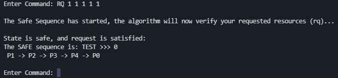
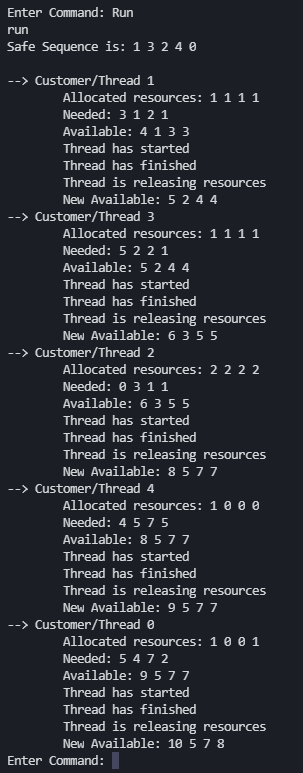

<h1 align="center">Bankers Algorithm - CP386</h1>


## Description
Creating the Bankers Algorithm. Banker's algo is used for resource allocation, as it incorperates deadlock avoidance through testing if the program is in a "safe" state before allocating the resources to customers. 


The final assignment of the CP386 (Operating Systems) course. 

## Motivation
*The honest answer: needs to be completed for marks :)*

## Installation
### PRE-REQ
- Linux system
- GCC compiler

### Steps
1. Clone the repository

2. Run the program (2 options)

#### Option 1 - Compile and run the program manually

Compile the .c file manually with the following line in the command line by navigating to the path which the files are located.

Run the follow command 

`gcc -o [ANY NAME] [.c FILE NAME] -lpthread -lrt`

Then, 

`./[ANY NAME] X X X X`

**note** - [ANY NAME] should be the same from both steps, and Xs get replaced with integers corrisponding to the resources available

#### Option 2 - use the Make file

In the terminal run `make`, then `make runq1` to execute the program

## Screenshots

First thing that appears when launching the program

Sample requets command output (RQ)



Sample release command output (RL)


Sample status command output (status)


Sample run command output (run)



## Individual contribution
*(author, co-author)*

`int readFileCustomers(char *fileName);` - Jagveer

`void readFileSequences(char *fileName, int max[n_rows][n_col]);` - Jagveer, Robert

`bool safety(int *available, int *allocated, int *need);` - Robert, Jagveer

`int sum_arr(int arr[], int n);` - Robert, Jagveer

`void get_n_col(char *filename);` - Robert, Jagveer

`int bankersalgo();` - Jagveer

`void run_cmd();` - Jagveer, Robert

`int request_resource(int args[]);` - Robert, Jagveer

`int release_resource(int args[]);` - Robert, Jagveer

`void status(int *available, int *max, int *allocation, int *need);` - Robert, Jagveer

`Blood, sweat, and tears` - Robert and Jagveer equally.


## Features

*The program was designed to be dynamic. The number of customers and resources are based on the text file matrix*
### Commands

Can enter commands in either lower case or upper case

#### Rquest Resource | RQ

Assigns resources to a specific customer from the available resources

```
Enter Command: RQ 1 2 3 1 1
```

#### Release Resource | RL

Releases resource that are in use by a customer.

```
Enter Command: RL 1 1 1 1 1
```

#### Run | run

Runs all the threads in it's safe sequence

```
Enter Command: run
```

#### Status | status

Displays the current status of all the matricies

```
Enter Command: status
```

#### Exit | exit

Terminates the program

```
Enter Command: exit
```
## Tests
Manual test cases, and lots of printf()
<details>
 <summary>Sample case</summary>
 
</details>

## Code Example
## Authors
- [Robert Mazza](https://github.com/Robert336)
- [Jagveer Sangha](https://github.com/Jagveer-Sangha)
## Credits
[GeeksforGeeks](https://www.geeksforgeeks.org/bankers-algorithm-in-operating-system-2/)

[StudyTonight](https://www.studytonight.com/operating-system/bankers-algorithm)

## License
This project is licensed under the MIT License.

[](https://github.com/Robert336/CP386-Final-Assignment/blob/main/LICENSE)

